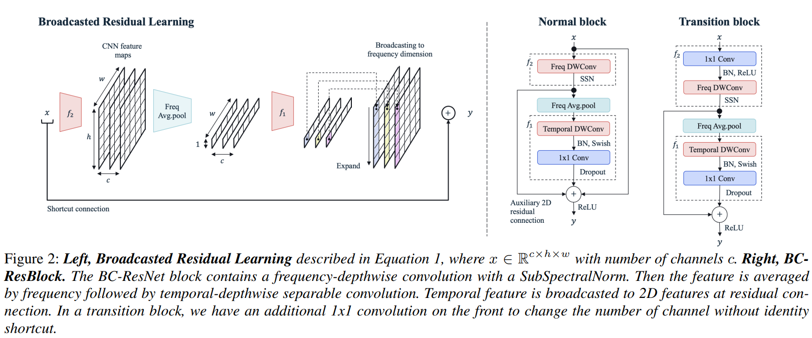

# Broadcasted Residual Learning for Efficient Keyword Spotting.
This repository contains the implementation for the paper presented in

**Byeonggeun Kim<sup>\*1</sup>, Simyung Chang<sup>\*1</sup>, Jinkyu Lee<sup>1</sup>, Dooyong Sung<sup>1</sup>, "Broadcasted Residual Learning for Efficient Keyword Spotting", Interspeech 2021.** [[ArXiv]](https://arxiv.org/abs/2106.04140)

*Equal contribution
<sup>1</sup> Qualcomm AI Research (Qualcomm AI Research is an initiative of Qualcomm Technologies, Inc.)

It contains the keyword spotting standard benchmark, [Google speech command datasets v1 and v2](https://arxiv.org/abs/1804.03209).

## Abstract


We propose a broadcasted residual learning method for keyword spotting that achieves high accuracy with small model size and computational load, making it well-suited for use on resource-constrained devices such as mobile phones. The method involves configuring most of the residual functions as 1D temporal convolutions while still allowing 2D convolutions via a broadcasted-residual connection that expands the temporal output to the frequency-temporal dimension. This approach enables the network to effectively represent useful audio features with much less computation than conventional convolutional neural networks. We also introduce a novel network architecture called the Broadcasting-residual network (BC-ResNet) that leverages this broadcasted residual learning approach, and we describe how to scale the model according to the target device's resources. BC-ResNets achieve state-of-the-art results, achieving 98.0% and 98.7% top-1 accuracy on Google speech command datasets v1 and v2, respectively. Our approach consistently outperforms previous approaches while using fewer computations and parameters.

## Getting Started

### Prerequisites
This code requires the following:
* python >= 3.6
* pytorch >= 1.7.1

### Installation
```
conda create -n bcresnet python=3.6
conda activate bcresnet
conda install pytorch==1.7.1 torchvision==0.8.2 torchaudio==0.7.2 -c pytorch
conda install tqdm, requests
```


## Usage
Here are some examples of how to use the code:

1. To use BCResNet-8 with GPU 0 and GSC dataset v2, and download the dataset, run the following command:
```
python main.py --tau 8 --gpu 0 --ver 2 --download
```
2. To use BCResNet-1 with GPU 1 and GSC dataset v1, and skip downloading the dataset, run the following command:
```
python main.py --tau 1 --gpu 1 --ver 1
```
The downloaded dataset will be saved to the data/ directory by default.

## Reference
If you find our work useful for your research, please cite the following:
```
@inproceedings{kim21l_interspeech,
  author={Byeonggeun Kim and Simyung Chang and Jinkyu Lee and Dooyong Sung},
  title={{Broadcasted Residual Learning for Efficient Keyword Spotting}},
  year=2021,
  booktitle={Proc. Interspeech 2021},
  pages={4538--4542},
  doi={10.21437/Interspeech.2021-383}
}
```